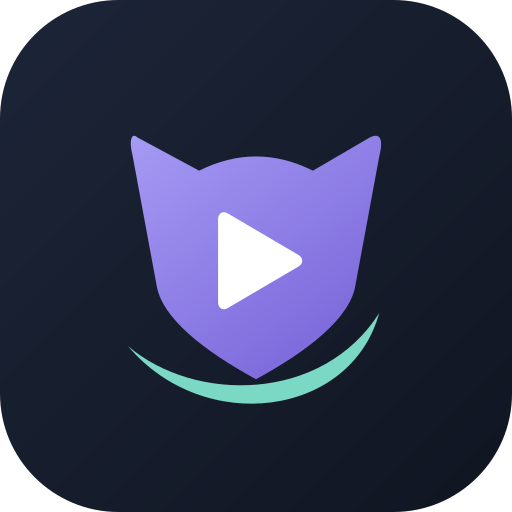
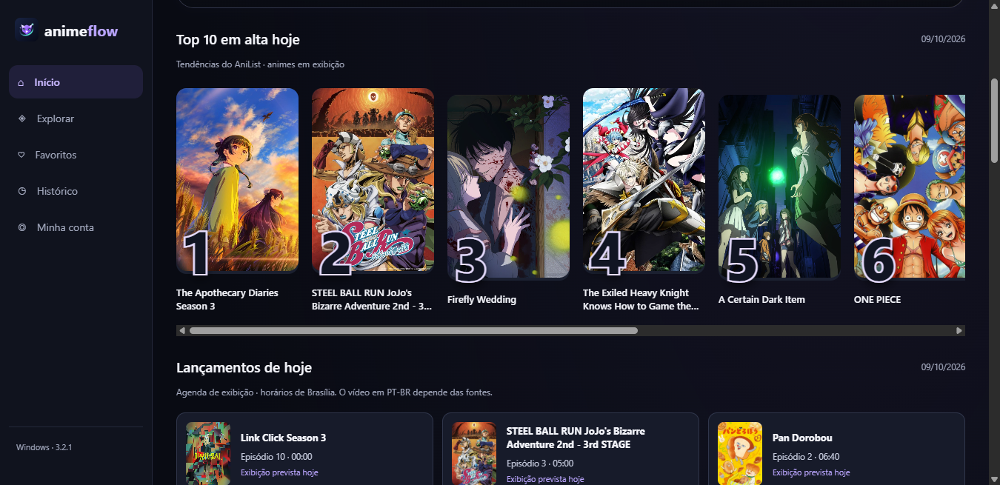

  
  <h1>AnimeFlow</h1>

  
<strong>3.2.1 estável · Android e Windows</strong>

  

    <a href="https://github.com/MysterGuy/AnimeFlow-Releases/releases/tag/v3.2.1">Baixar AnimeFlow</a> ·
    <a href="https://github.com/MysterGuy/AnimeFlow-Releases/releases">Versões anteriores</a> ·
    <a href="https://github.com/MysterGuy/AnimeFlow-Releases/issues">Relatar um problema</a>
  

---

AnimeFlow reúne descoberta de animes, reprodução dentro do aplicativo e uma biblioteca vinculada à sua conta. Explore gêneros e temporadas, guarde seus favoritos e continue de onde parou no Android ou no Windows.

Este repositório distribui os instaladores e as notas de atualização. O código-fonte não está publicado aqui.

## Download

| Plataforma | Versão | Download | Requisito |
| --- | --- | --- | --- |
| Android | 3.2.1 estável | [Baixar APK](https://github.com/MysterGuy/AnimeFlow-Releases/releases/download/v3.2.1/AnimeFlow-3.2.1.apk) | Android 8.0 ou superior |
| Windows | 3.2.1 estável | [Baixar instalador](https://github.com/MysterGuy/AnimeFlow-Releases/releases/download/v3.2.1/AnimeFlow-Windows-3.2.1-Setup.exe) | Windows de 64 bits |

Veja as [notas da versão 3.2.1](https://github.com/MysterGuy/AnimeFlow-Releases/releases/tag/v3.2.1).

## Um olhar para o aplicativo

*Top 10 e agenda consultados em 09/10/2026. O Android adapta essas seções à navegação no celular.*

## O que você encontra

- **Top 10 em alta hoje:** cards numerados com tendências do AniList entre animes em exibição.
- **Lançamentos de hoje:** agenda de episódios com horários de Brasília e indicação de exibição prevista.
- **Descoberta:** busca por nome e filtros de gênero, ano e temporada.
- **Biblioteca:** favoritos, histórico e progresso associados à sua conta Firebase.
- **Continue assistindo:** acesso aos títulos e episódios que você já começou.
- **Player integrado:** tela cheia, avanço e retorno de 10 segundos, velocidade, próximo episódio e avanço automático.
- **Pular abertura:** botão durante aberturas com marcação compatível no AniSkip, no Android e no Windows.
- **Idiomas:** opções legendadas e dubladas conforme a disponibilidade encontrada nas fontes.
- **Atualizações:** consulta e download de novas versões dentro do aplicativo.

## Começar a usar

### Android

1. Baixe o APK pelo link acima.
2. Abra o arquivo e, se o Android solicitar, permita a instalação pelo aplicativo usado para abrir o download.
3. Instale o AnimeFlow, entre ou crie sua conta e confirme o e-mail.
4. Escolha um anime e abra a lista de episódios.

### Windows

1. Baixe e execute o instalador.
2. Siga as etapas de instalação e abra o AnimeFlow.
3. Entre com sua conta ou cadastre uma nova conta e confirme o e-mail.

O instalador Windows ainda não possui certificado público de assinatura de código. O sistema pode mostrar aviso de editor desconhecido. Baixe pelos links deste repositório.

**Use a mesma conta nas duas plataformas** para acessar sua biblioteca. A sincronização exige conexão com a internet.

## Atualizar sem perder sua biblioteca

Abra **Minha conta → Verificar atualizações**. Conclua o download e a instalação. Também é possível baixar a versão mais recente deste repositório e instalar sobre a existente, **sem desinstalar**. O Android pede confirmação para concluir a instalação.

> **APK 3.1.8:** essa versão tinha o endereço do atualizador vazio. Baixe o APK 3.2.1 e instale por cima uma vez; as próximas versões podem ser consultadas no app.

A assinatura Android anterior foi preservada para permitir atualizar instalações existentes. Para recuperar a biblioteca ao trocar de aparelho, entre com o mesmo e-mail.

## Novidades da 3.2.1

O Android recebe próximo episódio, configuração de avanço automático e botão de pular abertura, acompanhando o player Windows da 3.2.0. Ambas as plataformas recebem o Top 10 e a agenda diária, com atualização a cada 15 minutos e renovação da agenda à meia-noite de Brasília.

**O ranking usa tendências do AniList, não visualizações diárias do AnimeFlow.** As posições podem permanecer iguais quando os dados da fonte não mudarem. A agenda informa estreias previstas; o vídeo em PT-BR pode chegar mais tarde.

O botão de abertura aparece durante o trecho marcado e pula para seu final. Os tempos são comunitários e não existem para todos os episódios. Se o serviço estiver indisponível ou a duração do vídeo não corresponder, o player continua funcionando sem o botão.

Marcações de abertura: [AniSkip](https://github.com/aniskip/aniskip-extension).

## Catálogo e disponibilidade

As informações vêm do **AniList**. A disponibilidade de episódios e idiomas depende das fontes de vídeo consultadas pelo aplicativo. Um título aparecer no catálogo de informações não significa que seus episódios estejam disponíveis para reprodução.

A cobertura varia por anime, temporada e idioma. Não há garantia de todos os animes, dublagem para todos os títulos ou lançamentos simultâneos a outros serviços. Não há vínculo com o Homura Animes ou com o AniList.

## Encontrou um problema?

[Abra uma issue](https://github.com/MysterGuy/AnimeFlow-Releases/issues/new) informando:

- Plataforma e versão do AnimeFlow.
- Anime, temporada e episódio.
- Idioma escolhido: legendado ou dublado.
- Mensagem de erro e, se possível, uma captura de tela.

Não inclua senhas, códigos de verificação ou dados pessoais no relato público.

---

AnimeFlow · Android e Windows

