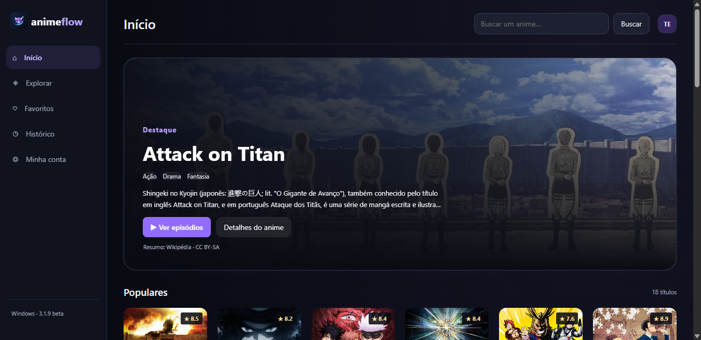

  
  <h1>AnimeFlow</h1>
  
Seu próximo anime. Sua biblioteca. Seu ritmo.

  
Disponível para Android e Windows · <strong>3.1.9 beta</strong>

  

    <a href="https://github.com/MysterGuy/AnimeFlow-Releases/releases/tag/v3.1.9-beta">Baixar</a> ·
    <a href="https://github.com/MysterGuy/AnimeFlow-Releases/releases">Versões anteriores</a> ·
    <a href="https://github.com/MysterGuy/AnimeFlow-Releases/issues">Relatar um problema</a>
  

---

AnimeFlow reúne descoberta de animes, reprodução dentro do aplicativo e uma biblioteca vinculada à sua conta. Explore gêneros e temporadas, guarde seus favoritos e continue de onde parou no Android ou no Windows.

> Este repositório distribui os instaladores e as notas de atualização do AnimeFlow. O aplicativo está em **beta**; o código-fonte não está publicado neste repositório.

## Download

| Plataforma | Versão | Download | Requisito |
| --- | --- | --- | --- |
| Android | 3.1.9 beta | [Baixar APK](https://github.com/MysterGuy/AnimeFlow-Releases/releases/download/v3.1.9-beta/AnimeFlow-3.1.9-beta.apk) | Android 8.0 ou superior |
| Windows | 3.1.9 beta | [Baixar instalador](https://github.com/MysterGuy/AnimeFlow-Releases/releases/download/v3.1.9-beta/AnimeFlow-Windows-3.1.9-Setup.exe) | Windows de 64 bits |

Você também pode consultar todos os arquivos na [página da versão 3.1.9](https://github.com/MysterGuy/AnimeFlow-Releases/releases/tag/v3.1.9-beta).

## Um olhar para o aplicativo

*Interface do Windows 3.1.9 beta. O Android também utiliza o visual escuro do AnimeFlow, com navegação adaptada ao celular.*

## O que você encontra

- **Descoberta:** busca por nome e filtros de gênero, ano e temporada de lançamento.
- **Biblioteca:** favoritos, histórico e progresso associados à sua conta Firebase.
- **Continue assistindo:** acesso aos títulos e episódios que você já começou.
- **Player integrado:** tela cheia, controles de reprodução, avanço e retorno de 10 segundos e ajuste de velocidade.
- **Idiomas:** opções legendadas e dubladas conforme a disponibilidade encontrada nas fontes.
- **Atualizações:** consulta e download de novas versões dentro do aplicativo.

## Começar a usar

### Android

1. Baixe o APK pelo link acima.
2. Abra o arquivo e, se o Android solicitar, permita a instalação pelo aplicativo usado para abrir o download.
3. Instale o AnimeFlow, crie sua conta e confirme o e-mail.
4. Escolha um anime e abra a lista de episódios.

### Windows

1. Baixe e execute o instalador.
2. Siga as etapas de instalação e abra o AnimeFlow.
3. Entre com sua conta ou cadastre uma nova conta e confirme o e-mail.

**Use a mesma conta nas duas plataformas** para acessar sua biblioteca. A sincronização de dados exige conexão com a internet.

## Atualizar sem perder sua biblioteca

> **Se você instalou o APK 3.1.8:** essa versão saiu com o endereço do atualizador vazio e não consegue buscar a correção. Baixe o APK 3.1.9 pelo link acima e instale por cima uma vez, sem desinstalar. As próximas versões podem ser consultadas no app. O Android pede confirmação para concluir a instalação.

Abra a área da sua conta no aplicativo e escolha **Verificar atualizações**. Quando houver uma versão nova, conclua o download e a instalação.

Também é possível baixar o instalador mais recente deste repositório e instalar sobre a versão existente. **Não é necessário desinstalar antes.** Para recuperar sua biblioteca ao reinstalar ou trocar de aparelho, entre com o mesmo e-mail.

## Novidades da 3.1.9 beta

- Corrigido o canal de atualização vazio do APK 3.1.8; a consulta agora é feita ao abrir o app.
- O Android abre o instalador após o download verificado e retoma o fluxo depois da permissão de instalação.
- Resumos em português pela Wikipédia quando existe uma página correspondente, com referência à fonte.
- Qualidade de vídeo selecionável quando a transmissão oferece alternativas.
- Próximo episódio automático configurável e atalhos F, M e N no Windows.
- Melhor legibilidade no banner, ano e status nos cards e placeholders de carregamento no Windows.

- Visual escuro com detalhes em violeta, banners maiores e cards arredondados.
- Filtros de temporada de lançamento e ano no Android e no Windows.
- Novos títulos na página inicial do Windows e consultas anuais atualizadas no Android.
- Correção dos filtros que descartavam dublagens da AnimesIce e da AnimesDigital.
- Melhor correspondência entre nomes alternativos, ingleses e japoneses ao procurar episódios.

Veja as [notas completas da versão](https://github.com/MysterGuy/AnimeFlow-Releases/releases/tag/v3.1.9-beta).

## Catálogo e disponibilidade

As informações dos animes vêm do **AniList**. A disponibilidade de episódios e idiomas depende das fontes de vídeo consultadas pelo aplicativo. Um título aparecer no catálogo de informações não significa que seus episódios estejam disponíveis para reprodução.

A cobertura pode variar por anime, temporada e idioma. O AnimeFlow não promete todos os animes, dublagem para todos os títulos ou lançamentos simultâneos a outros serviços. Não há vínculo com o Homura Animes ou com o AniList.

## Encontrou um problema?

[Abra uma issue](https://github.com/MysterGuy/AnimeFlow-Releases/issues/new) com estas informações:

- Plataforma e versão do AnimeFlow.
- Nome do anime, temporada e número do episódio.
- Idioma escolhido: legendado ou dublado.
- Mensagem de erro e, se possível, uma captura de tela.

Não inclua senhas, códigos de verificação ou outros dados pessoais no relato público.

---

  AnimeFlow · Android e Windows

